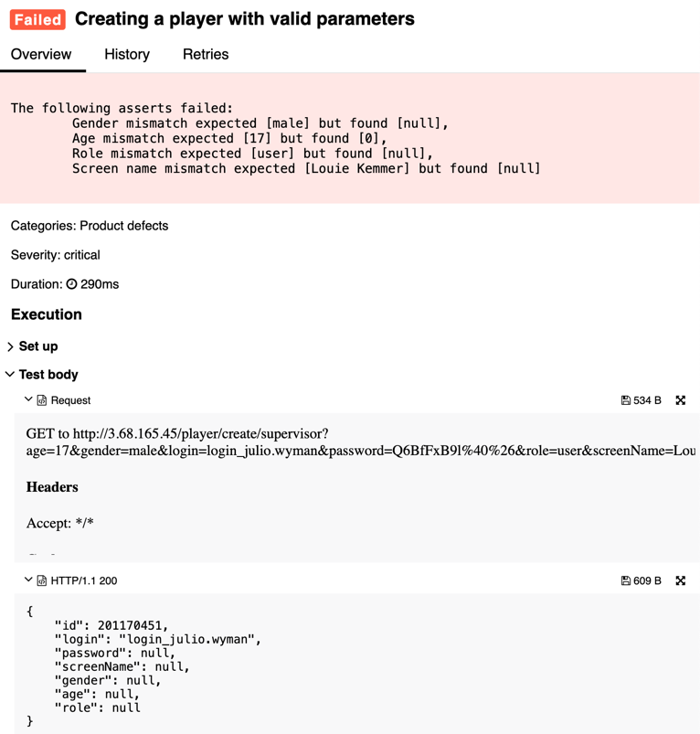

## 🐞 Bug Report

### 📋 Summary
**[#1]** `GET /player/create/{editor}` returns 200 OK but response contains `null` values for required fields.

---

### Attributes

- **Reporter:** Dastan Shokimov
- **Assigned To:** Dev
- **Priority:** High
- **Severity:** Critical
- **Reproducibility:** Always
- **Status:** New
- **Resolution:** Open
- **Platform:** Test Server

---

### 🧪 Description
The `createPlayer` endpoint responds with HTTP 200, but fields such as `screenName`, `role`, `gender`, `age`, and `password` return as `null`, even though valid values were sent as query parameters.


---

### 🔁 Steps to Reproduce

1. Open Postman or Rest Client
2. Set the request method to **GET**
3. Use the following URL: http://3.68.165.45/player/create/supervisor?age=25&gender=MALE&login=jackiechan&role=USER&screenName=Jackie%20Chan&password=test123
4. Send the request and observe the response

---

### ✅ Expected Result
- HTTP Status: `200 OK`
- JSON Body contains correct values:
```json
{
  "login": "jackiechan",
  "screenName": "Jackie Chan",
  "role": "USER",
  "age": 25,
  "gender": "MALE",
  "password": "test123"
}
```
### ✅ Actual Result
```json
{
"id": 96537149,
"login": "jackiechan",
"password": null,
"screenName": null,
"gender": null,
"age": null,
"role": null
}
```

