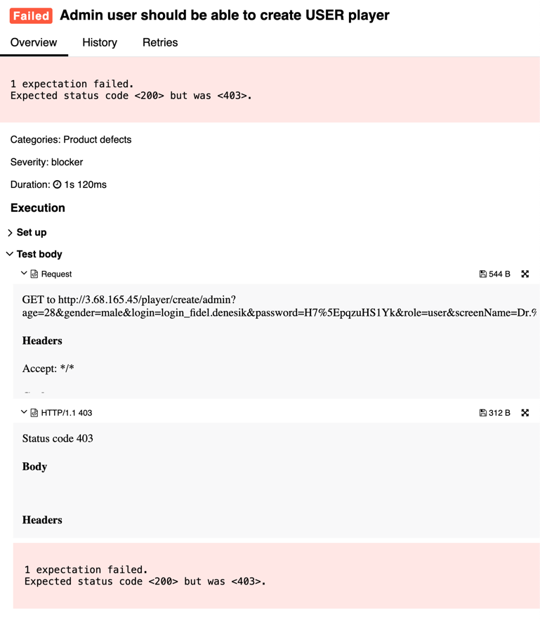

## 🐞 Bug Report

### 📋 Summary
**[#10]** `POST /player/create/{editor}` returns 403 Forbidden when an `admin` attempts to create a `user`, which violates the defined role permissions.

---

### Attributes

- **Reporter:** Dastan Shokimov
- **Assigned To:** Dev
- **Priority:** Critical
- **Severity:** Blocker
- **Reproducibility:** Always
- **Status:** New
- **Resolution:** Open
- **Platform:** Test Server

---

### 🧪 Description
According to the role model in the functional specification, a user with the `admin` role **can create new users** with the `user` role.

However, when an `admin` tries to create a player with role `user`, the server responds with `403 Forbidden`, blocking the operation.

This behavior contradicts the specification and blocks a valid user flow.



---

### 🔁 Steps to Reproduce

1. Ensure there is an existing `admin` user.
2. Open Postman or REST client.
3. Set the method to **POST**.
4. Use the following URL:  
   `http://3.68.165.45/player/create/admin`
5. Set the request body to:
```json
{
  "age": 28,
  "gender": "male",
  "login": "login_fidel.denesik",
  "password": "H7%5EpqzuHS1Yk",
  "role": "user",
  "screenName": "Dr.9"
}
Send the request.

✅ Expected Result

HTTP Status: 200 OK

New user with role user is created

❌ Actual Result

HTTP Status: 403 Forbidden

Operation is rejected, even though it is valid per role model