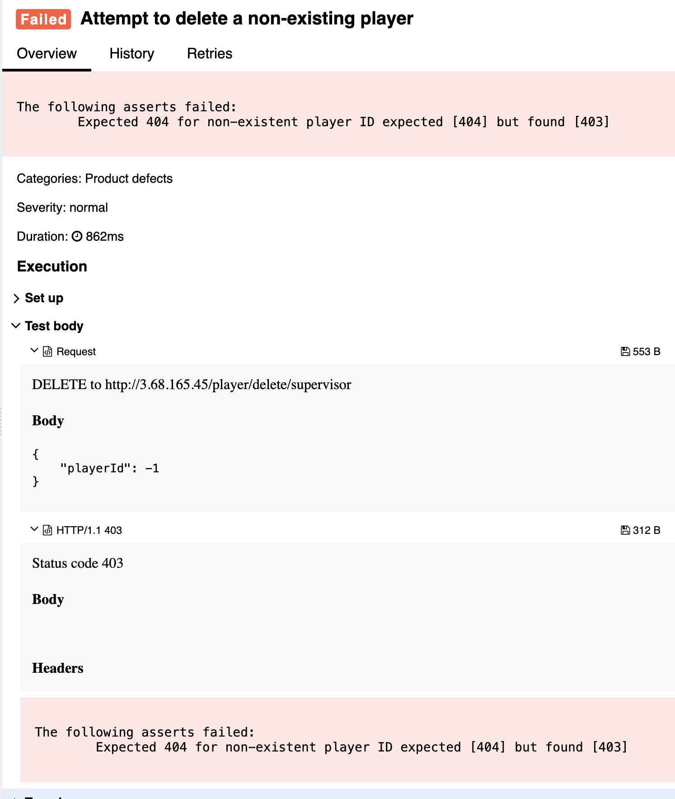

## 🐞 Bug Report

### 📋 Summary
**[#11]** `DELETE /player/delete/{editor}` returns 403 instead of 404 when attempting to delete a non-existent player.

---

### Attributes

- **Reporter:** Dastan Shokimov
- **Assigned To:** Dev
- **Priority:** Minor
- **Severity:** Normal
- **Reproducibility:** Always
- **Status:** New
- **Resolution:** Open
- **Platform:** Test Server

---

### 🧪 Description
According to standard REST practices, when attempting to delete a resource that does **not exist**, the expected behavior is to return **404 Not Found**.  
However, the API responds with **403 Forbidden**, which typically indicates a permission issue — not the absence of the target resource.

This causes confusion for clients and breaks error handling logic.



---

### 🔁 Steps to Reproduce

1. Open Postman or REST client.
2. Set the method to **DELETE**.
3. Use the following URL:  
   `http://3.68.165.45/player/delete/supervisor`
4. Set the request body to:
```json
{
  "playerId": -1
}
```
Send the request.

* Expected Result 
  * HTTP Status: 404 Not Found 
  * Error message: "Player not found"
* Actual Result 
  * HTTP Status: 403 Forbidden 
  * No clear indication of what went wrong