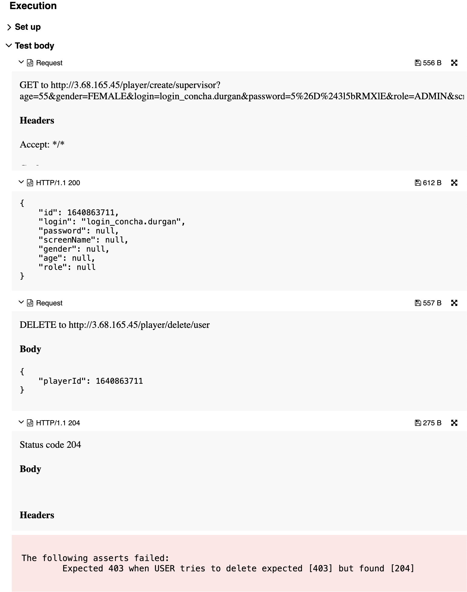

## 🐞 Bug Report

### 📋 Summary
**[#12]** `DELETE /player/delete/{editor}` allows users with the `user` role to delete other users, violating the access control rules defined in the specification.

---

### Attributes

- **Reporter:** Dastan Shokimov
- **Assigned To:** Dev
- **Priority:** Critical
- **Severity:** Major
- **Reproducibility:** Always
- **Status:** New
- **Resolution:** Open
- **Platform:** Test Server

---

### 🧪 Description
According to the role model in the functional specification, a user with the `user` role **cannot delete any players** — including themselves or others.

However, the system allows a `user` to send a DELETE request and successfully remove another player, returning `204 No Content`.

This behavior violates the security model and may lead to unauthorized data deletion.



---

### 🔁 Steps to Reproduce

1. Create a new user with role `ADMIN`:
   ```http
   POST /player/create/supervisor
   {
     "age": 55,
     "gender": "FEMALE",
     "login": "login_concha.durgan",
     "password": "5&6$1bRMXIE",
     "role": "ADMIN",
     "screenName": "admin_user"
   }
2. Use the newly created admin’s id for the next step. 
3. Send a DELETE request as a player with role USER:


```http
DELETE /player/delete/user
{
"playerId": 1640863711
}
```

* Expected Result 
  * HTTP Status: 403 Forbidden 
  * Error message: "user does not have permission to delete players"
* Actual Result 
  * HTTP Status: 204 No Content 
  * Player is deleted
