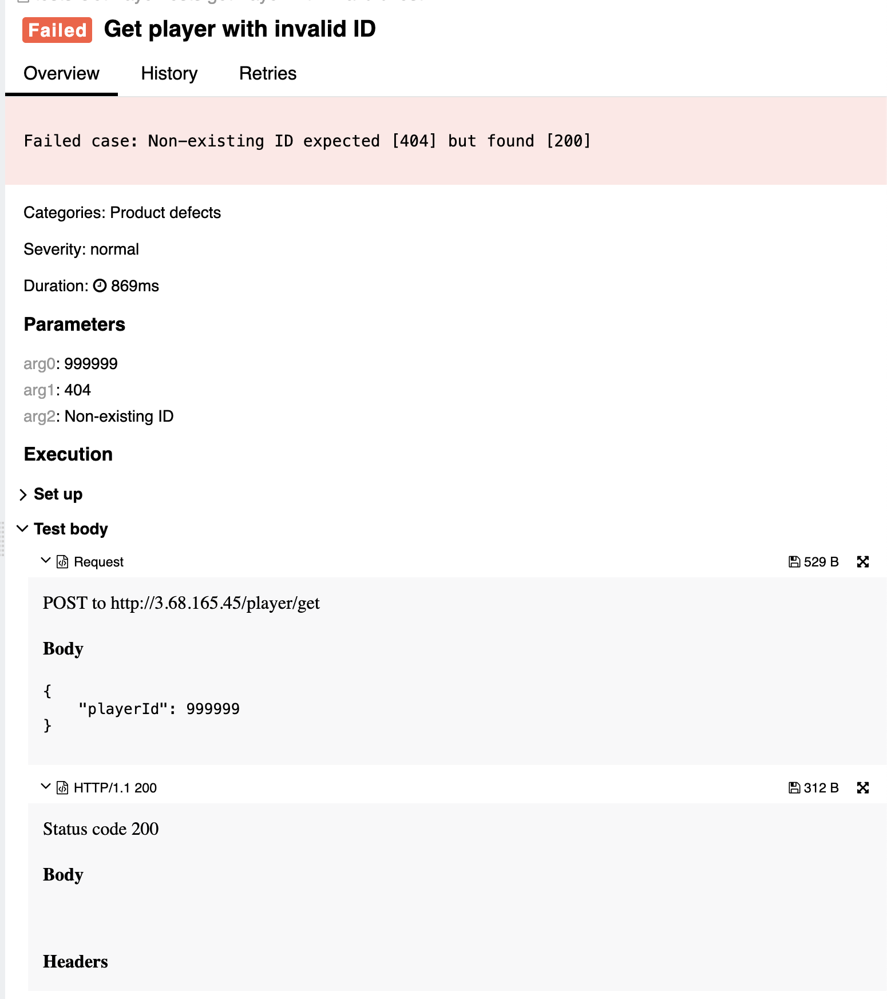

## 🐞 Bug Report

### 📋 Summary
**[#13]** `POST /player/get` returns 200 OK when requesting a non-existent player ID, violating REST error-handling conventions.

---

### Attributes

- **Reporter:** Dastan Shokimov
- **Assigned To:** Dev
- **Priority:** Major
- **Severity:** Normal
- **Reproducibility:** Always
- **Status:** New
- **Resolution:** Open
- **Platform:** Test Server

---

### 🧪 Description
When requesting a player by `playerId`, the system should return **404 Not Found** if the user does not exist.  
However, when sending a valid request with a **non-existent player ID**, the server responds with **200 OK**, even though no player data is returned.

This behavior:
- Breaks client-side logic
- Prevents correct error handling
- Violates REST standards



---

### 🔁 Steps to Reproduce

1. Open Postman or REST client.
2. Set the method to **POST**.
3. Use the following URL:  
   `http://3.68.165.45/player/get`
4. Set the request body to:
```json
{
  "playerId": 999999
}
``` 

5. Send the request.
* Expected Result 
  * HTTP Status: 404 Not Found 
  * Error message: "Player with given ID not found"
* Actual Result 
  * HTTP Status: 200 OK 
  * No player found, but request is marked as successful