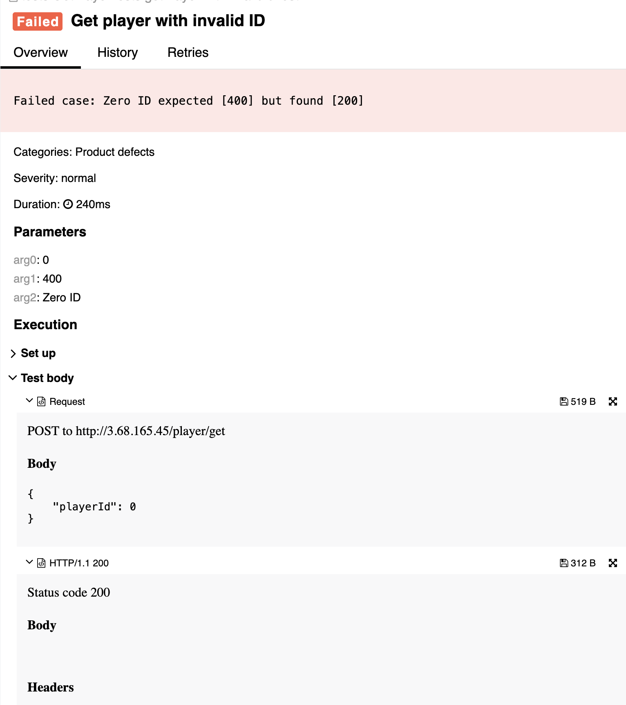

## 🐞 Bug Report

### 📋 Summary
**[#14]** `POST /player/get` returns 200 OK when `playerId` is 0, instead of returning 400 Bad Request for an invalid input.

---

### Attributes

- **Reporter:** Dastan Shokimov
- **Assigned To:** Dev
- **Priority:** Medium
- **Severity:** Normal
- **Reproducibility:** Always
- **Status:** New
- **Resolution:** Open
- **Platform:** Test Server

---

### 🧪 Description
The `playerId` field must represent a valid positive identifier.  
Sending `playerId = 0` is logically incorrect, as ID `0` is not expected to exist and is often reserved as invalid/default value.

However, the system responds with **200 OK**, even though no actual user is found and no validation error is thrown.



---

### 🔁 Steps to Reproduce

1. Open Postman or REST client.
2. Set the method to **POST**.
3. Use the following URL:  
   `http://3.68.165.45/player/get`
4. Set the request body to:
```json
{
  "playerId": 0
}
``` 

5. Send the request.
* Expected Result 
  * HTTP Status: 400 Bad Request 
  * Error message: "playerId must be a positive number"
* Actual Result 
  * HTTP Status: 200 OK 
  * No validation error is triggered

