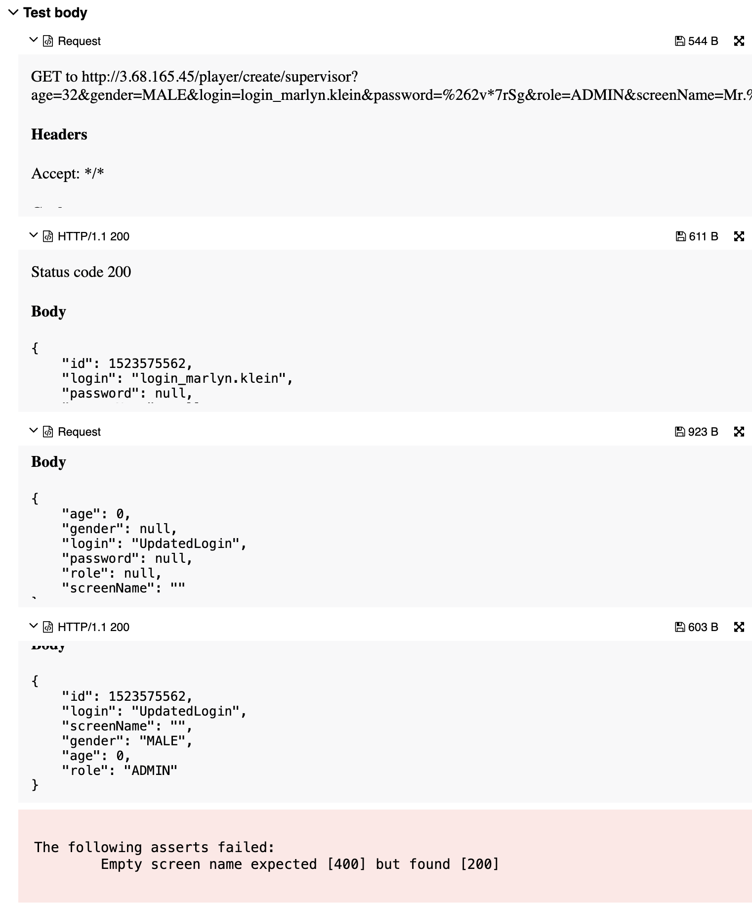

## 🐞 Bug Report

### 📋 Summary
**[#15]** `PATCH /player/update/{editor}/{id}` accepts an empty `screenName`, violating the required field constraint defined in the specification.

---

### Attributes

- **Reporter:** Dastan Shokimov
- **Assigned To:** Dev
- **Priority:** Major
- **Severity:** Normal
- **Reproducibility:** Always
- **Status:** New
- **Resolution:** Open
- **Platform:** Test Server

---

### 🧪 Description
According to the functional specification, `screenName` must be a **non-empty unique field**.  
However, when updating a player and setting `screenName` to an empty string (`""`), the system returns `200 OK` and applies the update.

This violates expected validation rules and may lead to data inconsistency or display issues in the UI.



---

### 🔁 Steps to Reproduce

1. Create a valid player:
```http
POST /player/create/supervisor
{
  "age": 32,
  "gender": "MALE",
  "login": "login_marlyn.klein",
  "password": "%262v*7rSg",
  "role": "ADMIN",
  "screenName": "Mr.Q"
}
```
2. Get the id from the response (e.g., 1523575562).
3. Send PATCH request to update the player:

```http
PATCH /player/update/supervisor/1523575562
{
  "login": "UpdatedLogin",
  "screenName": ""
}
```

* Expected Result 
  * HTTP Status: 400 Bad Request 
  * Error message: "screenName cannot be empty"
* Actual Result 
  * HTTP Status: 200 OK 
  * Player is updated with empty screenName
