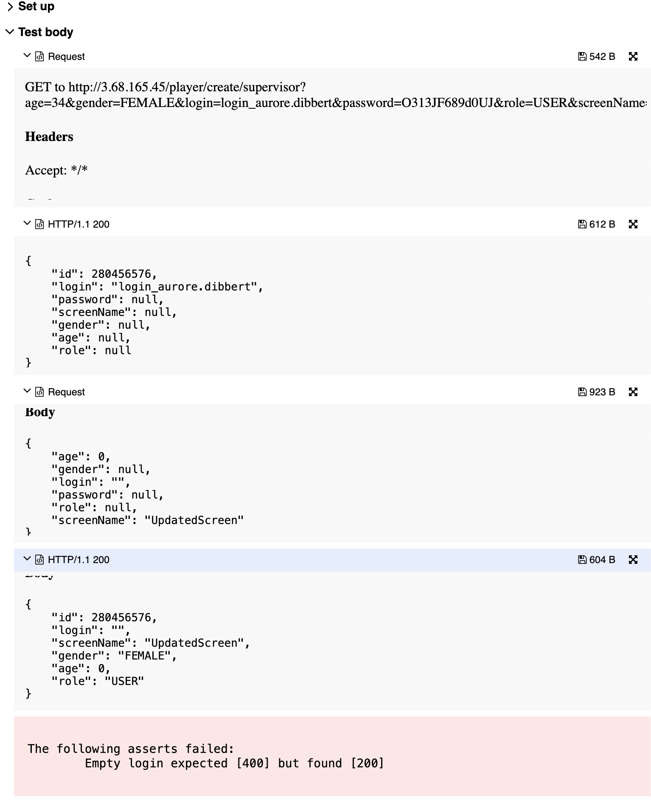

## 🐞 Bug Report

### 📋 Summary
**[#16]** `PATCH /player/update/{editor}/{id}` accepts an empty `login`, violating required field constraints.

---

### Attributes

- **Reporter:** Dastan Shokimov
- **Assigned To:** Dev
- **Priority:** Major
- **Severity:** Normal
- **Reproducibility:** Always
- **Status:** New
- **Resolution:** Open
- **Platform:** Test Server

---

### 🧪 Description
According to the specification, `login` is a required and unique field.  
However, when performing a `PATCH` request with `"login": ""`, the server returns `200 OK` and updates the user with an empty login.

This violates the expected validation and may result in undefined behavior or conflicts in authentication logic.



---

### 🔁 Steps to Reproduce

1. Create a valid player:
```http
POST /player/create/supervisor
{
  "age": 34,
  "gender": "FEMALE",
  "login": "login_aurore.dibbert",
  "password": "O313JF689d0UJ",
  "role": "USER",
  "screenName": "InitialScreen"
}
```
2. Extract the ID from the response (e.g., 280456576).

3. Send a PATCH request:

```http
PATCH /player/update/supervisor/280456576
{
  "login": "",
  "screenName": "UpdatedScreen"
}
```
* Expected Result 
  * HTTP Status: 400 Bad Request 
  * Error message: "login cannot be empty"
* Actual Result 
  * HTTP Status: 200 OK 
  * Player is updated with empty login