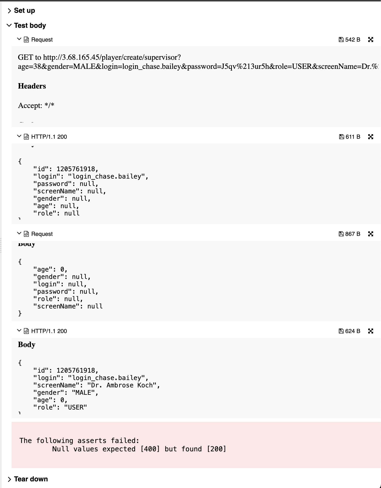

## 🐞 Bug Report

### 📋 Summary
**[#17]** `PATCH /player/update/{editor}/{id}` accepts `null` values in required fields, violating field validation rules.

---

### Attributes

- **Reporter:** Dastan Shokimov
- **Assigned To:** Dev
- **Priority:** Major
- **Severity:** Normal
- **Reproducibility:** Always
- **Status:** New
- **Resolution:** Open
- **Platform:** Test Server

---

### 🧪 Description
According to the functional specification, fields like `login`, `screenName`, `age`, `gender`, `role`, and `password` must be properly validated.  
However, when these fields are explicitly set to `null` in a `PATCH` request, the API returns `200 OK` and silently updates the user.

This violates data integrity and leads to inconsistent or broken user records.



---

### 🔁 Steps to Reproduce

1. Create a valid player:
```http
POST /player/create/supervisor
{
  "age": 38,
  "gender": "MALE",
  "login": "login_chase.bailey",
  "password": "J5qv%213ur5h",
  "role": "USER",
  "screenName": "Dr. Ambrose Koch"
}
```
2. Get the ID from the response (e.g., 1205761918). 
3. Send PATCH request with nulls:


```http
PATCH /player/update/supervisor/1205761918
{
  "age": 0,
  "gender": null,
  "login": null,
  "password": null,
  "role": null,
  "screenName": null
}
```
* Expected Result 
  * HTTP Status: 400 Bad Request 
  * Error message: "Fields cannot be null"
* Actual Result 
  * HTTP Status: 200 OK 
  * Player is updated with incomplete/null data