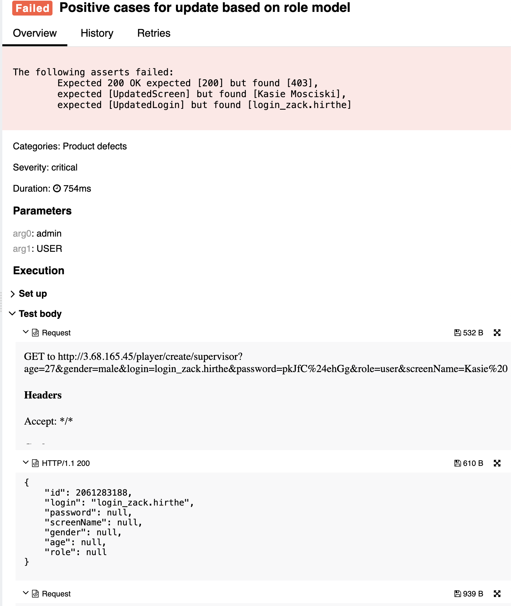
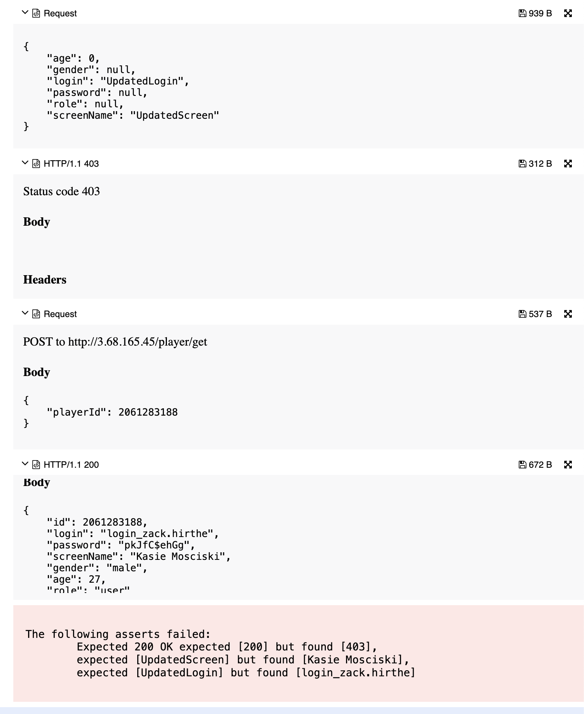

## 🐞 Bug Report

### 📋 Summary
**[#18]** `PATCH /player/update/{editor}/{id}` returns 403 Forbidden when an `admin` tries to update a `user`, despite having permission per the role model.

---

### Attributes

- **Reporter:** Dastan Shokimov
- **Assigned To:** Dev
- **Priority:** Critical
- **Severity:** Major
- **Reproducibility:** Always
- **Status:** New
- **Resolution:** Open
- **Platform:** Test Server

---

### 🧪 Description
According to the role model in the functional specification:
- Users with the `admin` role can perform operations on users with `user` and `admin` roles (if acting on themselves for admin).

However, when an `admin` tries to update a `user`, the system returns `403 Forbidden`.  
This behavior blocks a valid and expected flow and violates the defined access control.




---

### 🔁 Steps to Reproduce

1. Create a player with role `USER`:
```http
POST /player/create/supervisor
{
  "age": 27,
  "gender": "male",
  "login": "login_zack.hirthe",
  "password": "pkJfC$24ehGg",
  "role": "user",
  "screenName": "Kasie Mosciski"
}
```
2. Attempt to update this player as admin:

```http
PATCH /player/update/admin/2061283188
{
  "login": "UpdatedLogin",
  "screenName": "UpdatedScreen"
}
``` 
3. Confirm result via GET /player/get
* Expected Result 
  * HTTP Status: 200 OK 
  * Player updated with new login and screenName
* Actual Result 
  * HTTP Status: 403 Forbidden 
  * No changes applied, update blocked

