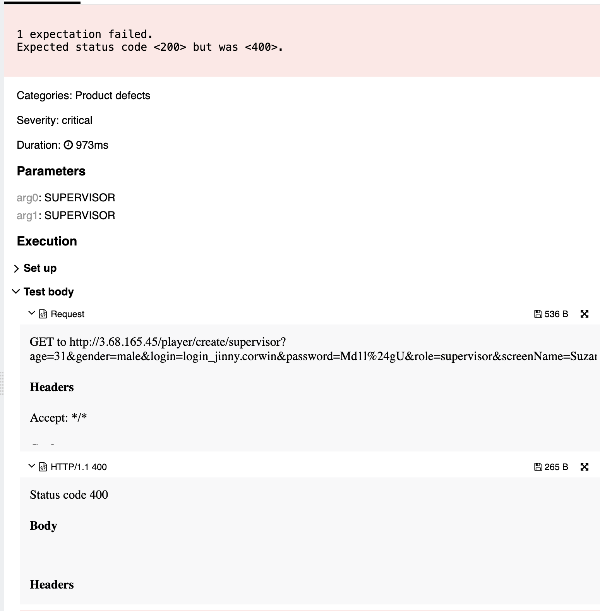

## 🐞 Bug Report

### 📋 Summary
**[#19]** `POST /player/create/{editor}` returns 400 Bad Request when a `SUPERVISOR` attempts to create another `SUPERVISOR`, violating the expected role capabilities.

---

### Attributes

- **Reporter:** Dastan Shokimov
- **Assigned To:** Dev
- **Priority:** Critical
- **Severity:** Major
- **Reproducibility:** Always
- **Status:** New
- **Resolution:** Open
- **Platform:** Test Server

---

### 🧪 Description
According to the specification, a user with the role `SUPERVISOR` should be able to perform **any operation**, including creating users of any role, except deleting other supervisors.

However, when attempting to create a new user with role `SUPERVISOR`, the system returns a `400 Bad Request`.

This violates the permission model and blocks valid administrative actions.



---

### 🔁 Steps to Reproduce

1. Log in as `SUPERVISOR`
2. Send the following request:
```http
GET http://3.68.165.45/player/create/supervisor?age=31&gender=male&login=login_jinny.corwin&password=Md1l%24gU&role=supervisor&screenName=Suzan
```
* Expected Result 
  * HTTP Status: 200 OK 
  * New user with role SUPERVISOR is created
* Actual Result 
  * HTTP Status: 400 Bad Request 
  * No user created