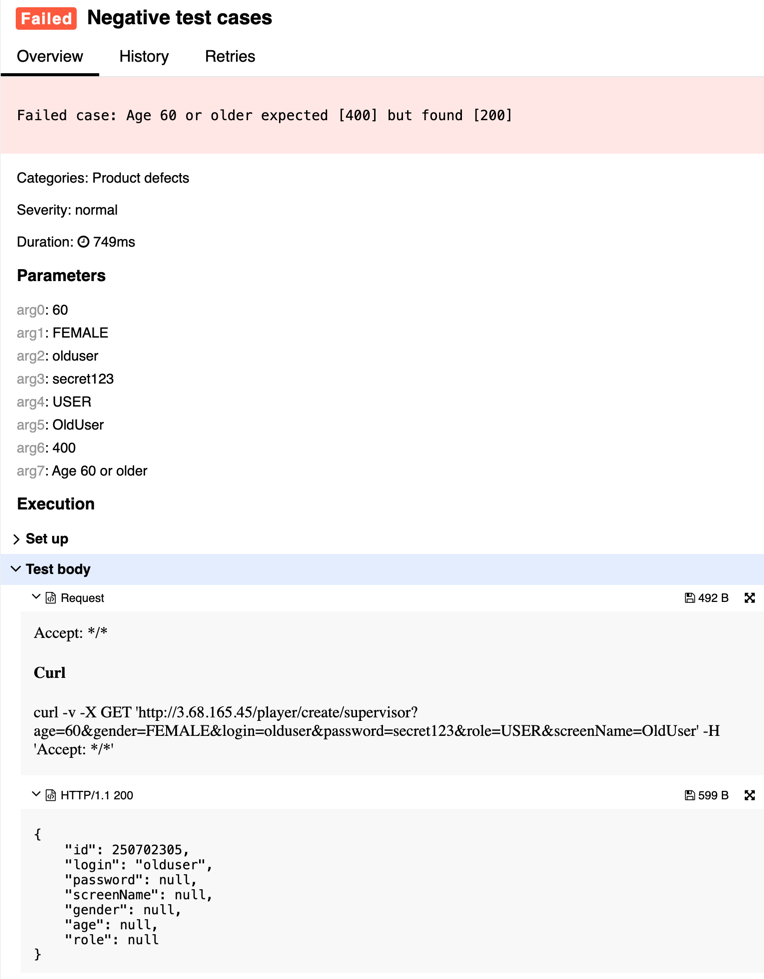

## 🐞 Bug Report

### 📋 Summary
**[#4]** `POST /player/create/{editor}` accepts users aged 60 or older, violating age constraints in the functional specification.

---

### Attributes

- **Reporter:** Dastan Shokimov
- **Assigned To:** Dev
- **Priority:** Major
- **Severity:** Normal
- **Reproducibility:** Always
- **Status:** New
- **Resolution:** Open
- **Platform:** Test Server

---

### 🧪 Description
According to the specification, the age of a user must be **greater than 16 and less than 60**.  
However, a player with age `60` is successfully created and the server responds with `200 OK`.


This violates the expected age boundaries and may lead to incorrect data handling.

---

### 🔁 Steps to Reproduce

1. Open Postman or any REST client.
2. Set the method to **POST**.
3. Use the following URL:  
   `http://3.68.165.45/player/create/supervisor`
4. Set the request body to:
```json
{
  "age": 60,
  "gender": "FEMALE",
  "login": "olduser",
  "password": "secret123",
  "role": "USER",
  "screenName": "OldUser"
}
```
5. Send the request.
* Expected Result 
  * HTTP Status: 400 Bad Request 
  * Error message: "age must be less than 60"
* Actual Result  
  * HTTP Status: 200 OK 
  * User with invalid age is created
