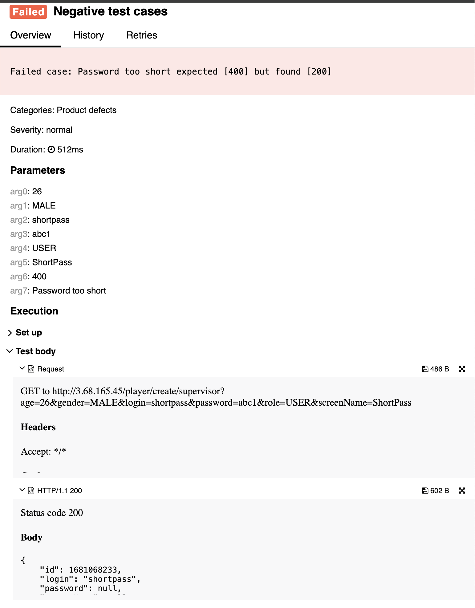

## 🐞 Bug Report

### 📋 Summary
**[#5]** `POST /player/create/{editor}` accepts a password shorter than 7 characters, violating password constraints in the functional specification.

---

### Attributes

- **Reporter:** Dastan Shokimov
- **Assigned To:** Dev
- **Priority:** Major
- **Severity:** Normal
- **Reproducibility:** Always
- **Status:** New
- **Resolution:** Open
- **Platform:** Test Server

---

### 🧪 Description
According to the specification, the password must consist of **latin letters and numbers**, and be **between 7 and 15 characters** in length.  
However, a player is successfully created with a password `"abc1"` (length = 4), and the server responds with `200 OK`.  
This violates the expected password format and may result in insecure user credentials.



---

### 🔁 Steps to Reproduce

1. Open Postman or any REST client.
2. Set the method to **POST**.
3. Use the following URL:  
   `http://3.68.165.45/player/create/supervisor`
4. Set the request body to:
```json
{
  "age": 26,
  "gender": "MALE",
  "login": "shortpass",
  "password": "abc1",
  "role": "USER",
  "screenName": "ShortPass"
}
```
5. Send the request. 
* Expected Result 
  * HTTP Status: 400 Bad Request 
  * Error message: "password length must be between 7 and 15 characters"
* Actual Result 
  * HTTP Status: 200 OK 
  * User is created with invalid password

6. 