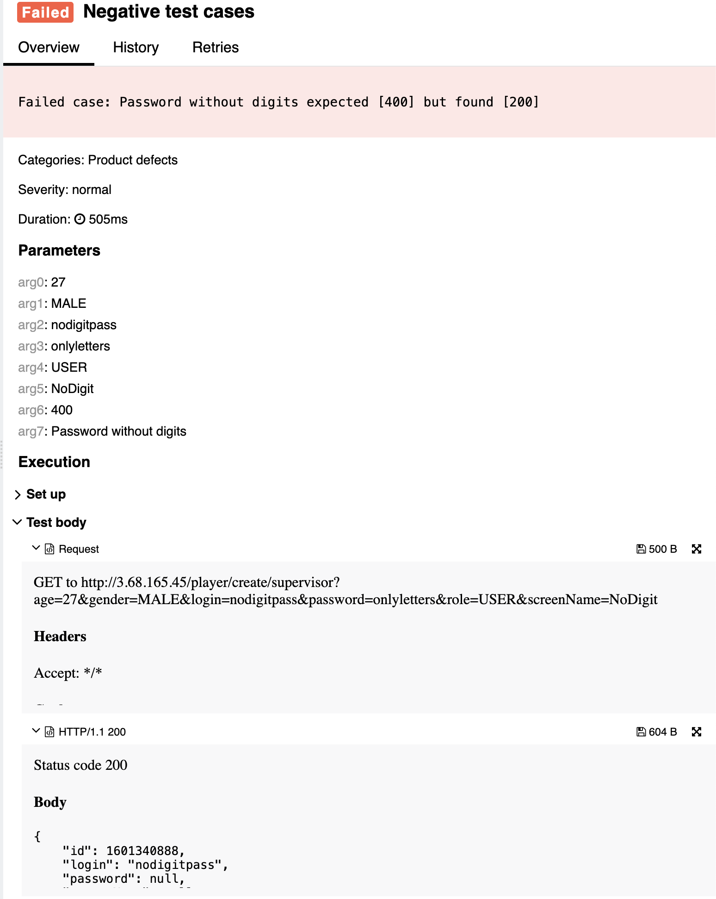

## 🐞 Bug Report

### 📋 Summary
**[#6]** `POST /player/create/{editor}` accepts a password that contains only letters and no digits, violating password constraints.

---

### Attributes

- **Reporter:** Dastan Shokimov
- **Assigned To:** Dev
- **Priority:** Major
- **Severity:** Normal
- **Reproducibility:** Always
- **Status:** New
- **Resolution:** Open
- **Platform:** Test Server

---

### 🧪 Description
According to the specification, the password must consist of **latin letters and numbers** (i.e., contain both letters and digits), and be 7–15 characters long.  
However, the system allows creation of a player with password `"onlyletters"` (letters only), and responds with `200 OK`.

This violates the password complexity rules and poses a security risk.



---

### 🔁 Steps to Reproduce

1. Open Postman or any REST client.
2. Set the method to **POST**.
3. Use the following URL:  
   `http://3.68.165.45/player/create/supervisor`
4. Set the request body to:
```json
{
  "age": 27,
  "gender": "MALE",
  "login": "nodigitpass",
  "password": "onlyletters",
  "role": "USER",
  "screenName": "NoDigit"
}
```
5. Send the request. 
* Expected Result 
  * HTTP Status: 400 Bad Request 
  * Error message: "password must contain both letters and digits"
* Actual Result 
  * HTTP Status: 200 OK 
  * Player is created with invalid password
