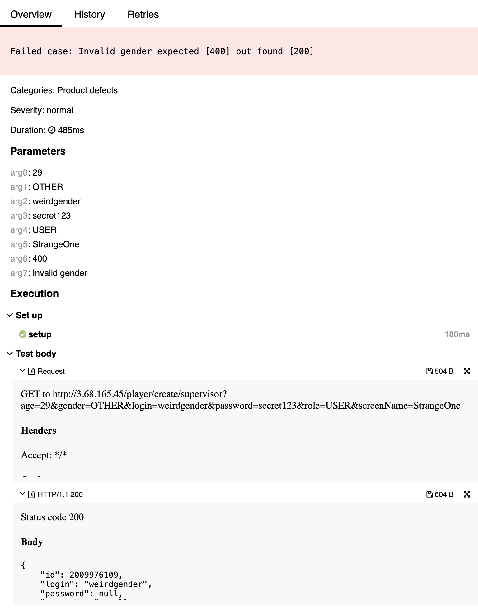

## 🐞 Bug Report

### 📋 Summary
**[#7]** `POST /player/create/{editor}` accepts an invalid gender value (`OTHER`), violating allowed enumeration of gender values.

---

### Attributes

- **Reporter:** Dastan Shokimov
- **Assigned To:** Dev
- **Priority:** Major
- **Severity:** Normal
- **Reproducibility:** Always
- **Status:** New
- **Resolution:** Open
- **Platform:** Test Server

---

### 🧪 Description
According to the specification, the `gender` field must only accept `"MALE"` or `"FEMALE"`.  
However, the system allows creation of a player with gender `"OTHER"` and responds with `200 OK`.

This violates the enum constraint for gender and may result in undefined behavior in systems expecting strict values.



---

### 🔁 Steps to Reproduce

1. Open Postman or any REST client.
2. Set the method to **POST**.
3. Use the following URL:  
   `http://3.68.165.45/player/create/supervisor`
4. Set the request body to:
```json
{
  "age": 29,
  "gender": "OTHER",
  "login": "weirdgender",
  "password": "secret123",
  "role": "USER",
  "screenName": "StrangeOne"
}
```
5. Send the request.
* Expected Result 
  * HTTP Status: 400 Bad Request 
  * Error message: "gender must be either 'MALE' or 'FEMALE'"
* Actual Result 
  * HTTP Status: 200 OK 
  * User is created with invalid gender