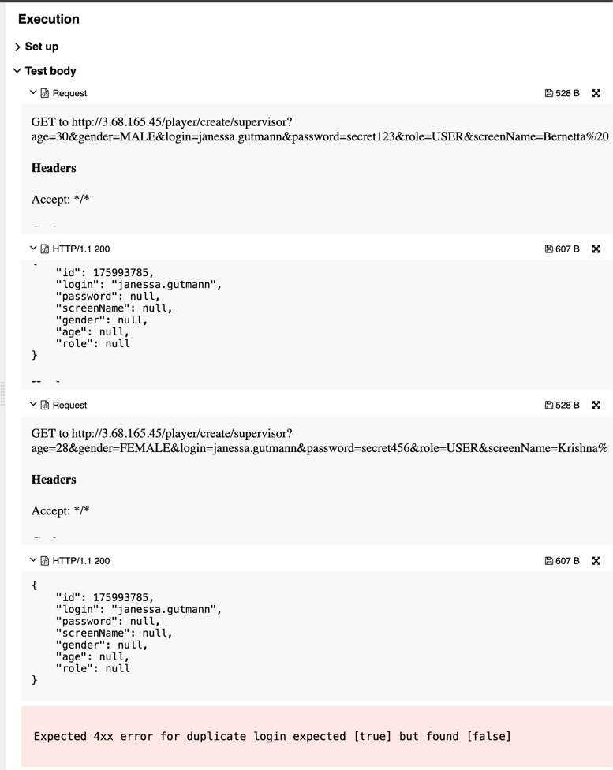

## 🐞 Bug Report

### 📋 Summary
**[#8]** `POST /player/create/{editor}` silently updates an existing user if `login` already exists, instead of returning an error.

---

### Attributes

- **Reporter:** Dastan Shokimov
- **Assigned To:** Dev
- **Priority:** Critical
- **Severity:** Major
- **Reproducibility:** Always
- **Status:** New
- **Resolution:** Open
- **Platform:** Test Server

---

### 🧪 Description
According to the functional specification, the `login` field must be **unique** for each user.  
However, if we send a request with an already existing login, the API returns `200 OK`, does not create a new user, and **returns the same user ID** as in the previous request — implying a silent update.

This behavior:
- Violates the expected uniqueness constraint
- May cause data inconsistency
- Is dangerous in production environments



---

### 🔁 Steps to Reproduce

1. Open Postman or any REST client.
2. Set the method to **POST**.
3. Use the following URL:  
   `http://3.68.165.45/player/create/supervisor`

#### First request (valid):
```json
{
  "age": 30,
  "gender": "MALE",
  "login": "janessa.gutmann",
  "password": "secret123",
  "role": "USER",
  "screenName": "Bernetta"
}
```
#### First request (valid):
```json
{
  "age": 28,
  "gender": "FEMALE",
  "login": "janessa.gutmann",
  "password": "secret456",
  "role": "USER",
  "screenName": "Krishna"
}
```
* Expected Result 
  * HTTP Status: 400 Bad Request 
  * Error message: "login must be unique"
  * No modification to existing user
* Actual Result 
  * HTTP Status: 200 OK 
  * Existing user was silently updated (same ID returned)