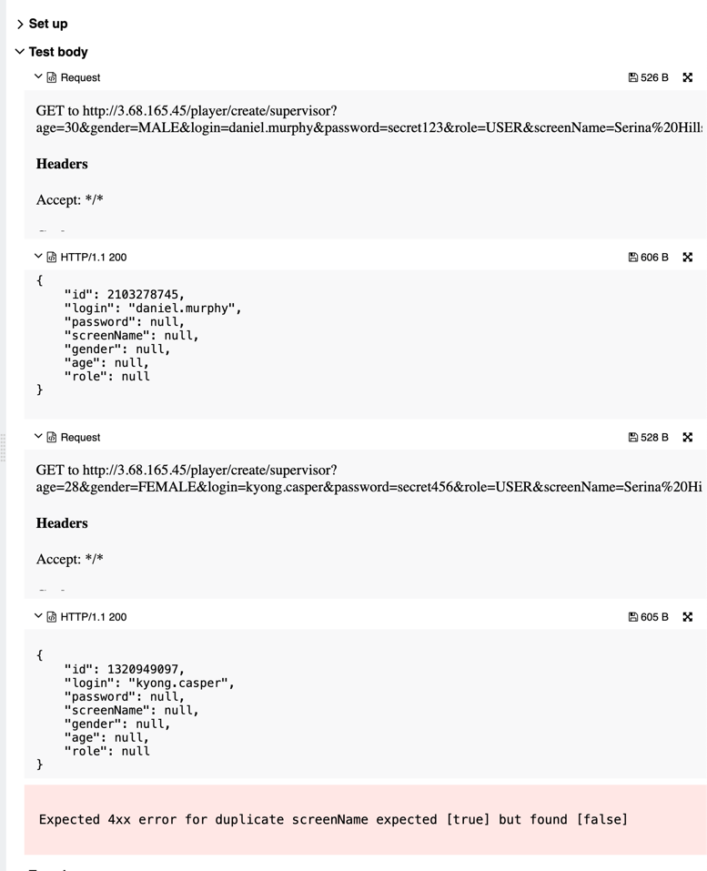

## 🐞 Bug Report

### 📋 Summary
**[#9]** `POST /player/create/{editor}` allows creation of users with duplicate `screenName`, violating uniqueness constraint from the specification.

---

### Attributes

- **Reporter:** Dastan Shokimov
- **Assigned To:** Dev
- **Priority:** Major
- **Severity:** Normal
- **Reproducibility:** Always
- **Status:** New
- **Resolution:** Open
- **Platform:** Test Server

---

### 🧪 Description
According to the functional specification, the `screenName` field must be **unique** for each user.  
However, the API allows creation of multiple users with the same `screenName`, responding with `200 OK` and different user IDs.

This behavior leads to inconsistent user identity handling and violates uniqueness requirements.



---

### 🔁 Steps to Reproduce

1. Open Postman or any REST client.
2. Set the method to **POST**.
3. Use the following URL:  
   `http://3.68.165.45/player/create/supervisor`

#### First request:
```json
{
  "age": 30,
  "gender": "MALE",
  "login": "jessenia.leuschke",
  "password": "secret123",
  "role": "USER",
  "screenName": "Charline Klo"
}
```
✅ Response:
HTTP 200 OK, ID: 1094653628

Second request (duplicate screenName):
```json
{
  "age": 28,
  "gender": "FEMALE",
  "login": "edgar.will",
  "password": "secret456",
  "role": "USER",
  "screenName": "Charline Klo"
}
```
* Response:
  * HTTP 200 OK, ID: 635955534

* Expected Result 
  * HTTP Status: 400 Bad Request 
  * Error message: "screenName must be unique"
* Actual Result 
  * HTTP Status: 200 OK 
  * Second user created with duplicate screenName